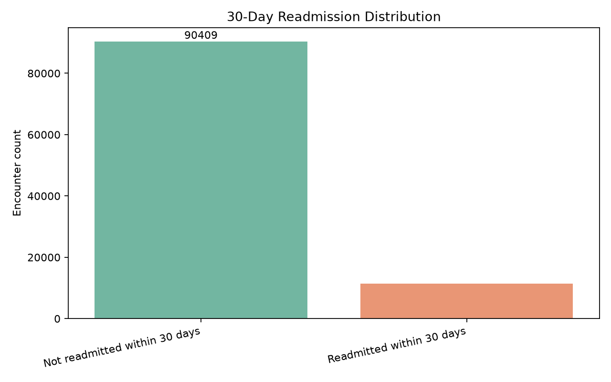
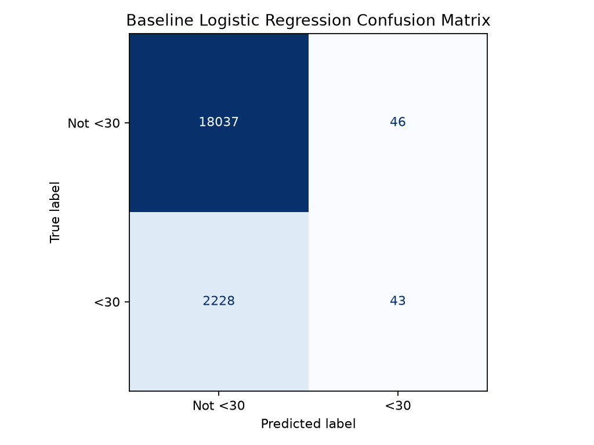
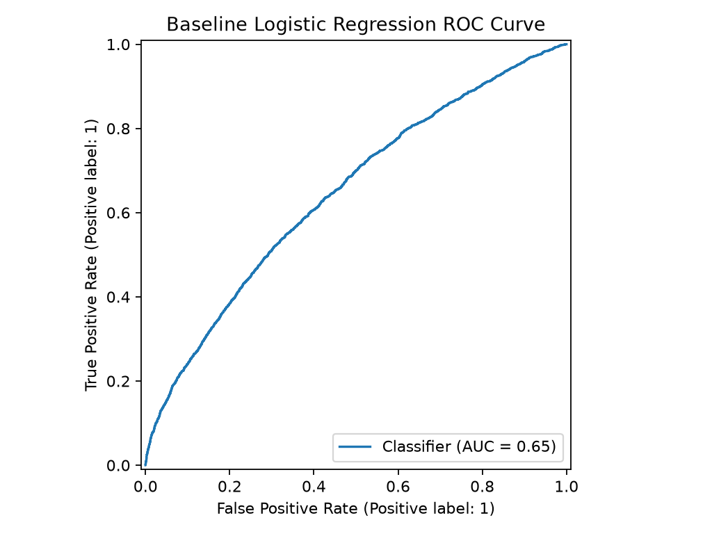
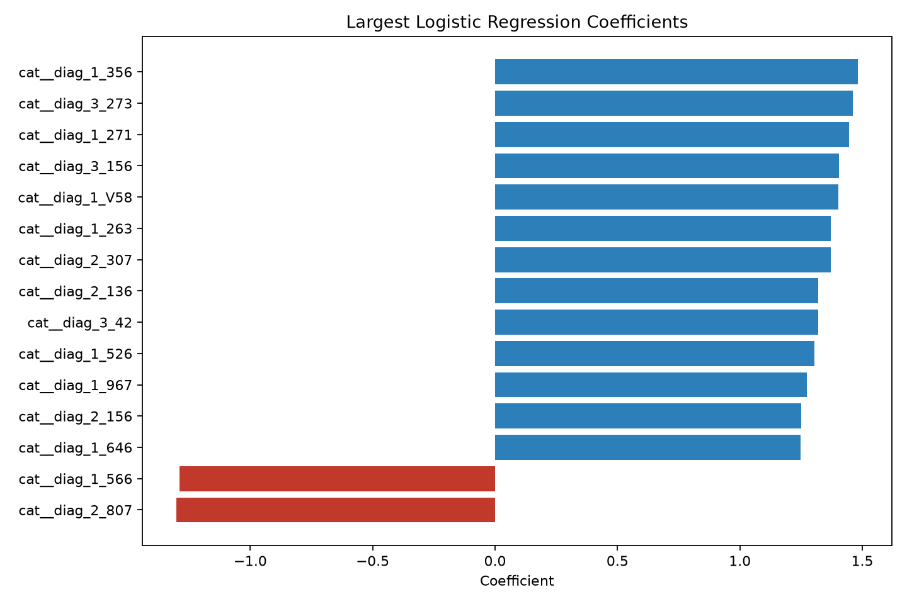

# Predicting 30-Day Hospital Readmission Risk

This project demonstrates an end-to-end baseline healthcare analytics workflow using a public hospital dataset to explore 30-day readmission risk.

The goal is not to make clinical decisions. The project is intended to show data cleaning, baseline modeling, evaluation, and clear communication of model limitations for healthcare analytics and care-coordination contexts.

## Healthcare / Business Problem

Thirty-day hospital readmissions can point to gaps in discharge planning, follow-up care, medication management, or patient support. A practical analytics workflow can help healthcare teams explore which encounter-level factors may be associated with higher readmission risk and where additional follow-up planning might be useful.

## Dataset

- **Source:** Diabetes 130-US hospitals dataset, 1999-2008
- **Publisher:** UCI Machine Learning Repository
- **Scope:** 100,000+ hospital encounters for patients with diabetes
- **Target:** Whether an encounter resulted in readmission within 30 days
- **Privacy note:** The public dataset does not include PHI in this repository.

## Tools Used

- Python
- pandas
- scikit-learn
- matplotlib
- seaborn
- Logistic regression
- Git/GitHub

## Methods

1. Download and extract the public UCI dataset.
2. Replace missing-value placeholders and remove identifier columns.
3. Convert readmission status into a binary 30-day readmission target.
4. Split the data into train/test sets with stratification.
5. Build a preprocessing pipeline for numeric and categorical columns.
6. Train a baseline logistic regression model.
7. Evaluate the model with classification metrics, a confusion matrix, and ROC AUC.

## Results

The baseline model runs successfully on the processed dataset. Metrics below are from `python src/model.py` using an 80/20 stratified train/test split and a default 0.5 classification threshold.

| Metric | Value |
| --- | ---: |
| Accuracy | 0.888 |
| Precision | 0.483 |
| Recall | 0.019 |
| F1 score | 0.036 |
| ROC AUC | 0.647 |

The accuracy is high because the dataset is imbalanced, but recall is very low at the default threshold. This makes the project a useful baseline analytics demonstration, not a clinical decision tool.

## Visuals

### Readmission Distribution



### Confusion Matrix



### ROC Curve



### Largest Logistic Regression Coefficients



## Repository Structure

- `src/data.py` - downloads, extracts, and preprocesses the public dataset
- `src/model.py` - trains and evaluates the baseline logistic regression model
- `src/visualize.py` - generates the README visuals from the processed data/model
- `images/` - generated model and data visuals
- `requirements.txt` - Python dependencies
- `LICENSE` - MIT license

## How to Run

```bash
git clone https://github.com/Juan-R1/healthcare-readmission-risk.git
cd healthcare-readmission-risk

python3 -m venv venv
source venv/bin/activate
pip install -r requirements.txt

python src/data.py
python src/model.py
python src/visualize.py
```

Generated raw and processed data files are written to `data/`, which is intentionally ignored by git.

## Limitations

- This is a baseline model, not a production clinical decision-support system.
- The dataset is historical and may not reflect current hospital workflows or patient populations.
- The default 0.5 threshold produces low recall for the 30-day readmission class.
- Readmission risk is influenced by clinical, social, operational, and access-to-care factors that are not fully captured here.
- Logistic regression coefficients show model associations, not causal drivers.

## Next Steps

- Tune the classification threshold to better support a recall-focused care-coordination use case.
- Compare logistic regression against tree-based baseline models.
- Add cross-validation and class-imbalance handling.
- Build a concise stakeholder dashboard for readmission-risk monitoring.
- Add a notebook version of the workflow for easier walkthroughs.

## Resume Bullet

Built a Python healthcare analytics project using a 100,000+ encounter public hospital dataset to clean clinical encounter data, train a baseline 30-day readmission risk model, evaluate model performance, and communicate limitations for care-coordination and quality-improvement use cases.

## LinkedIn Project Blurb

I built a baseline healthcare analytics project using the Diabetes 130-US hospitals dataset to explore 30-day readmission risk. The workflow includes data preprocessing, logistic regression modeling, evaluation visuals, and a plain-language discussion of why this is a portfolio analytics project rather than a clinical decision tool.
